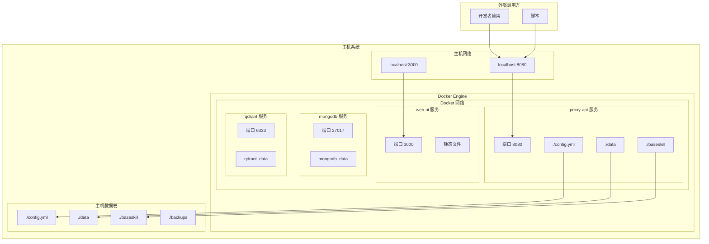
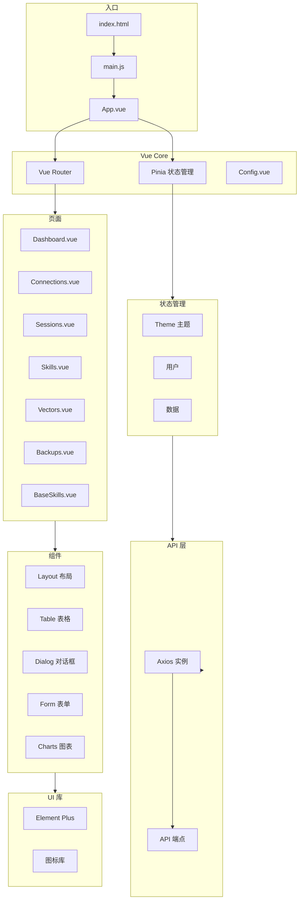
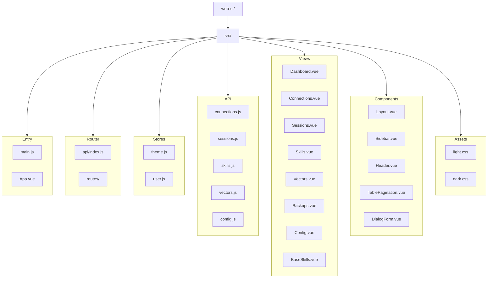
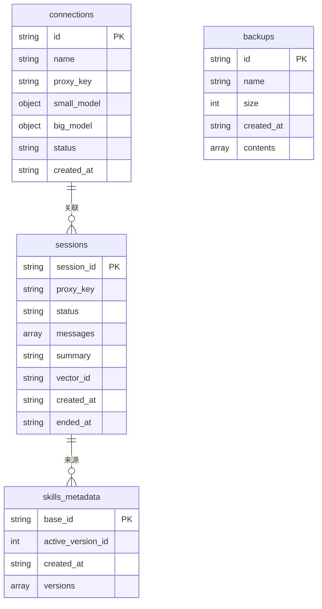
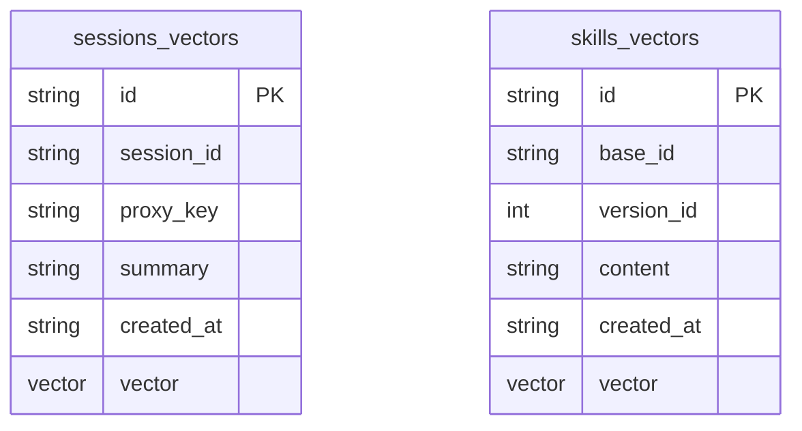
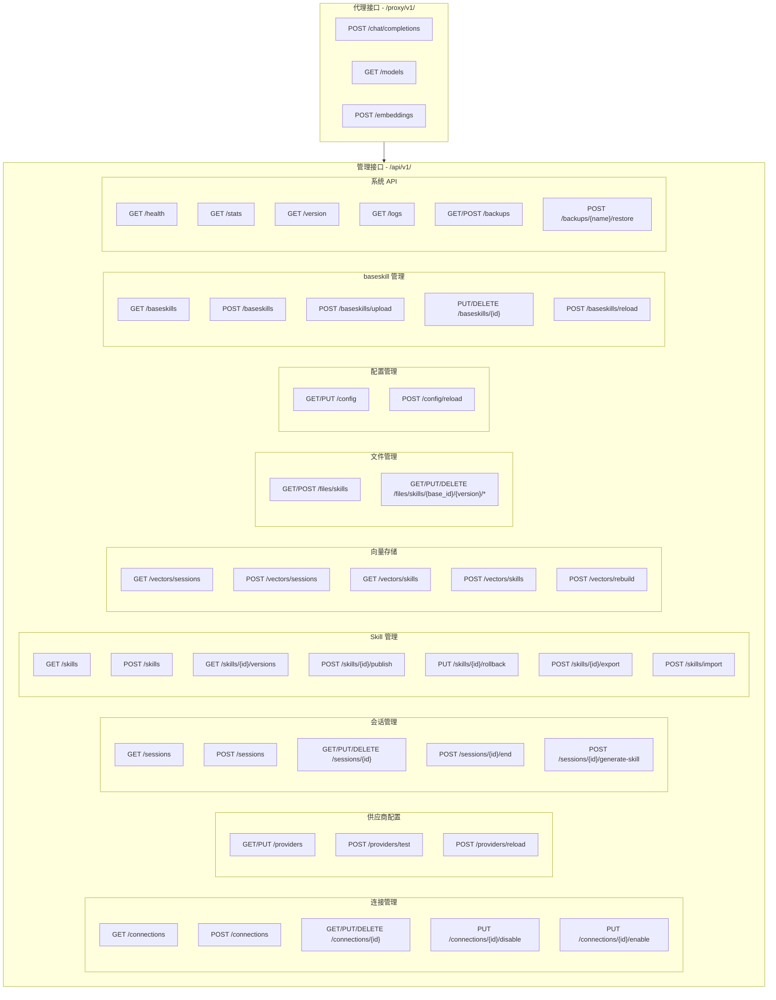
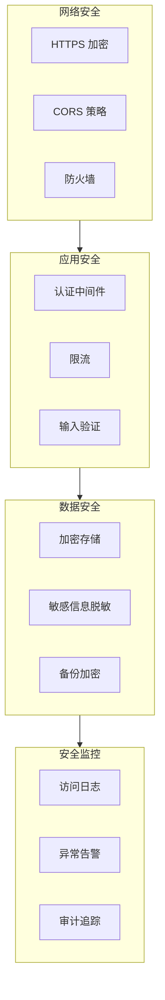
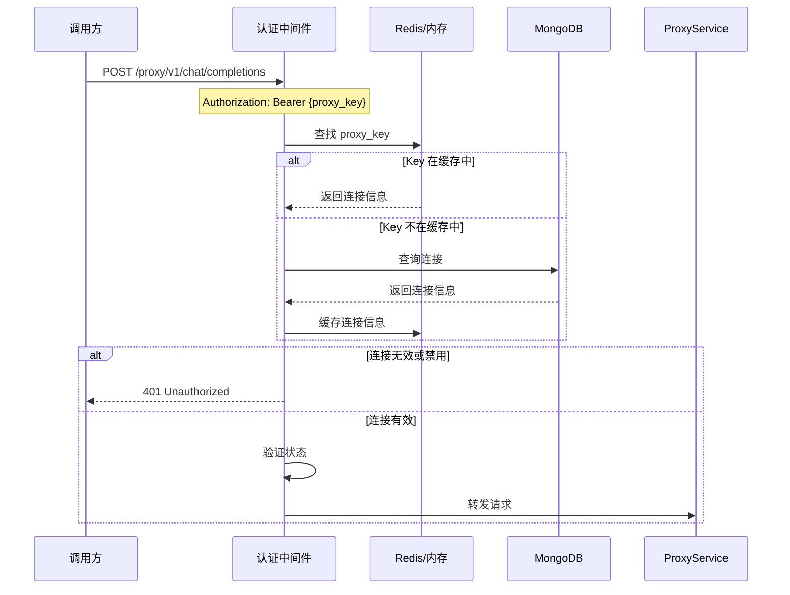
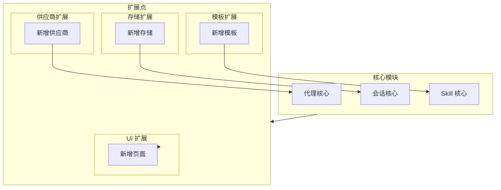
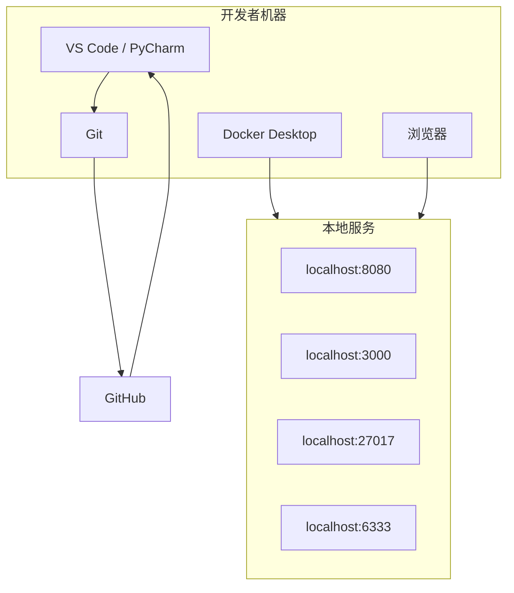

# TW AI 节能器 - 架构图集

> 版本：v1.0  
> 日期：2026-02-02  
> 说明：使用 Mermaid 语法绘制的架构图

---

## 一、系统整体架构

### 1.1 逻辑架构图

```mermaid
flowchart TB
    subgraph Client [客户端]
        WebBrowser[Web 浏览器]
        APIClient[API 调用方]
    end
    
    subgraph Deployment [部署层]
        Docker[Docker Compose]
        
        subgraph ProxyAPI [Proxy API 容器]
            FastAPI[FastAPI 应用]
            
            subgraph API_Layer [API 层]
                ProxyRoutes[/proxy/v1/*]
                AdminRoutes[/api/v1/*]
            end
            
            subgraph Service_Layer [服务层]
                ProxyService[代理转发服务]
                SessionService[会话服务]
                SkillService[Skill 服务]
                VectorService[向量服务]
                ConfigService[配置服务]
                BaseskillService[模板服务]
            end
            
            subgraph Domain_Layer [领域层]
                ProxyGateway[代理网关]
                SessionManager[会话管理]
                SkillManager[Skill 管理]
                VectorRepository[向量仓储]
            end
            
            subgraph Infra_Layer [基础设施层]
                MongoDBClient[MongoDB Client]
                QdrantClient[Qdrant Client]
                FileManager[文件管理]
                BaseskillLoader[模板加载器]
            end
            
            subgraph Core_Layer [核心层]
                ConfigLoader[配置加载]
                Logger[日志]
                Security[安全]
            end
        end
        
        subgraph WebUI [Web UI 容器]
            Nginx[Nginx 服务器]
            VueApp[Vue 3 应用]
            
            subgraph VueLayers [Vue 层]
                Views[页面组件]
                Stores[Pinia 状态]
                Router[路由]
                API[API 封装]
            end
            
            subgraph UIComponents [UI 组件]
                ElementPlus[Element Plus]
                Theme[主题切换]
            end
        end
        
        subgraph DataStore [数据存储]
            MongoDB[(MongoDB 7)]
            Qdrant[(Qdrant)]
            Files[本地文件系统]
            ConfigFile[config.yml]
        end
        
        subgraph BaseSkill [模板目录]
            BS_SG[skill-generator]
            BS_SS[session-summarizer]
            BS_V[vectorizer]
            BS_SNG[skill-name-generator]
        end
    end
    
    subgraph External [外部系统]
        OpenAI[OpenAI API]
        SiliconFlow[硅基流动]
        Ollama[Ollama]
        LMStudio[LM Studio]
    end
    
    WebBrowser --> Nginx
    APIClient --> ProxyRoutes
    
    Nginx --> VueApp
    VueApp --> AdminRoutes
    
    ProxyRoutes --> ProxyService
    AdminRoutes --> SessionService
    AdminRoutes --> SkillService
    AdminRoutes --> VectorService
    AdminRoutes --> ConfigService
    AdminRoutes --> BaseskillService
    
    ProxyService --> ProxyGateway
    SessionService --> SessionManager
    SkillService --> SkillManager
    VectorService --> VectorRepository
    
    ProxyGateway --> MongoDBClient
    SessionManager --> MongoDBClient
    SkillManager --> MongoDBClient
    
    VectorRepository --> QdrantClient
    SkillManager --> FileManager
    
    ConfigLoader --> ConfigFile
    BaseskillLoader --> BS_SG
    BaseskillLoader --> BS_SS
    BaseskillLoader --> BS_V
    BaseskillLoader --> BS_SNG
    
    ProxyService --> OpenAI
    ProxyService --> SiliconFlow
    ProxyService --> Ollama
    ProxyService --> LMStudio
    
    MongoDBClient --> MongoDB
    QdrantClient --> Qdrant
    FileManager --> Files
```

### 1.2 部署架构图



---

## 二、后端架构

### 2.1 后端分层架构

```mermaid
flowchart TB
    subgraph API_Layer [API 层 - api/]
        ProxyAPI[/proxy/v1/*]
        AdminAPI[/api/v1/*]
    end
    
    subgraph Service_Layer [服务层 - services/]
        ProxyService[ProxyService]
        SessionService[SessionService]
        SkillService[SkillService]
        VectorService[VectorService]
        ConfigService[ConfigService]
        BaseskillService[BaseskillService]
    end
    
    subgraph Domain_Layer [领域层 - domain/]
        subgraph Models [领域模型]
            Connection[Connection]
            Session[Session]
            Skill[Skill]
            Provider[Provider]
        end
        
        subgraph Repositories [仓储接口]
            SessionRepo[SessionRepository]
            SkillRepo[SkillRepository]
            VectorRepo[VectorRepository]
        end
    end
    
    subgraph Infra_Layer [基础设施层 - infrastructure/]
        subgraph Database [数据库]
            MongoDB[MongoDB]
            Qdrant[Qdrant]
        end
        
        subgraph Repositories [仓储实现]
            SessionRepoImpl[SessionRepositoryImpl]
            SkillRepoImpl[SkillRepositoryImpl]
            VectorRepoImpl[VectorRepositoryImpl]
        end
        
        FileManager[FileManager]
        Scheduler[Scheduler]
    end
    
    subgraph Core_Layer [核心层 - core/]
        Config[Config]
        Logger[Logger]
        Security[Security]
        Constants[Constants]
    end
    
    ProxyAPI --> ProxyService
    AdminAPI --> SessionService
    AdminAPI --> SkillService
    AdminAPI --> VectorService
    AdminAPI --> ConfigService
    AdminAPI --> BaseskillService
    
    ProxyService --> Domain_Layer
    SessionService --> Domain_Layer
    SkillService --> Domain_Layer
    VectorService --> Domain_Layer
    
    Domain_Layer --> Infra_Layer
    Infra_Layer --> Core_Layer
```

### 2.2 后端目录结构

```mermaid
flowchart TD
    root[ytzc-ai-proxy/]
    
    subgraph ProxyAPI [proxy-api/]
        app[app/]
        
        subgraph AppDirs
            api[api/]
            services[services/]
            domain[domain/]
            infrastructure[infrastructure/]
            core[core/]
        end
        
        api --> ProxyAPI[proxy/]
        api --> AdminAPI[admin/]
        api --> WebAPI[web/]
        
        services --> PS[proxy_service.py]
        services --> SS[session_service.py]
        services --> SkS[skill_service.py]
        services --> VS[vector_service.py]
        services --> CS[config_service.py]
        services --> BS[baseskill_service.py]
        
        domain --> Models[models/]
        domain --> Repos[repositories/]
        
        infrastructure --> DB[database/]
        infrastructure --> ReposImpl[repositories/]
        infrastructure --> FM[file_manager.py]
        
        core --> Config[config.py]
        core --> Logger[logger.py]
        core --> Security[security.py]
    end
    
    root --> ProxyAPI
    root --> WebUI[web-ui/]
    root --> Baseskill[baseskill/]
    root --> Data[data/]
    root --> ConfigYML[config.yml]
    root --> DockerCompose[docker-compose.yml]
```

### 2.3 类关系图

```mermaid
classDiagram
    %% 连接相关
    class ProxyConnection {
        +String id
        +String name
        +String proxy_key
        +ModelConfig small_model
        +ModelConfig big_model
        +ConnectionStatus status
        +String created_at
    }
    
    class ModelConfig {
        +String name
        +String base_url
        +String api_key
    }
    
    enum ConnectionStatus {
        +ENABLED
        +DISABLED
    }
    
    %% 会话相关
    class Session {
        +String session_id
        +String proxy_key
        +SessionStatus status
        +List~Message~ messages
        +String summary
        +String vector_id
        +String created_at
        +String ended_at
    }
    
    class Message {
        +String role
        +String content
        +String model
        +String timestamp
    }
    
    enum SessionStatus {
        +ACTIVE
        +ENDED
    }
    
    %% Skill 相关
    class Skill {
        +String base_id
        +int active_version_id
        +String created_at
        +List~SkillVersion~ versions
    }
    
    class SkillVersion {
        +int version_id
        +SkillStatus status
        +String created_at
        +String created_by
        +String source_session_id
        +String change_reason
    }
    
    enum SkillStatus {
        +DRAFT
        +PUBLISHED
        +DEPRECATED
    }
    
    %% 关系
    ProxyConnection "1" --> "*" Session : 关联
    Session "1" --> "*" Message : 包含
    Skill "1" --> "*" SkillVersion : 包含
    
    ProxyConnection --> ModelConfig : small_model
    ProxyConnection --> ModelConfig : big_model
    ProxyConnection --> ConnectionStatus : status
    Session --> SessionStatus : status
    SkillVersion --> SkillStatus : status
```

---

## 三、前端架构

### 3.1 前端架构图



### 3.2 前端目录结构



---

## 四、数据架构

### 4.1 数据存储架构

```mermaid
flowchart TB
    subgraph Application [应用层]
        FastAPI[FastAPI 应用]
        VueApp[Vue 应用]
    end
    
    subgraph DataAccess [数据访问层]
        Motor[Motor (MongoDB)]
        QdrantClient[Qdrant Client]
        FileSystem[文件系统]
        YAML[YAML 配置]
    end
    
    subgraph Storage [存储层]
        subgraph MongoDB [MongoDB]
            direction TB
            Connections[connections 集合]
            Sessions[sessions 集合]
            Skills[skills 集合]
            Metadata[metadata 集合]
        end
        
        subgraph Qdrant [Qdrant]
            SessionsVec[sessions 集合]
            SkillsVec[skills 集合]
        end
        
        subgraph Files [文件系统]
            SkillsFiles[Skill 文件]
            BaseskillFiles[模板文件]
            Backups[备份文件]
        end
        
        subgraph Config [配置]
            AppConfig[config.yml]
        end
    end
    
    Application --> DataAccess
    DataAccess --> Storage
    
    Motor --> Connections
    Motor --> Sessions
    Motor --> Skills
    Motor --> Metadata
    
    QdrantClient --> SessionsVec
    QdrantClient --> SkillsVec
    
    FileSystem --> SkillsFiles
    FileSystem --> BaseskillFiles
    FileSystem --> Backups
    
    YAML --> AppConfig
```

### 4.2 MongoDB 数据模型



### 4.3 Qdrant 集合



---

## 五、接口架构

### 5.1 API 分组



---

## 六、安全架构

### 6.1 安全分层



### 6.2 认证流程



---

## 七、扩展性设计

### 7.1 模块扩展点



---

## 八、开发环境架构

### 8.1 开发环境



---

> 文档状态：**已完成**  
> 参考：开发计划.md、流程图.md、需求分析.md
