# TW AI 节能器 - 流程图集

> 版本：v1.0  
> 日期：2026-02-02  
> 说明：使用 Mermaid 语法绘制的流程图

---

## 一、代理请求处理流程

### 1.1 完整请求流程

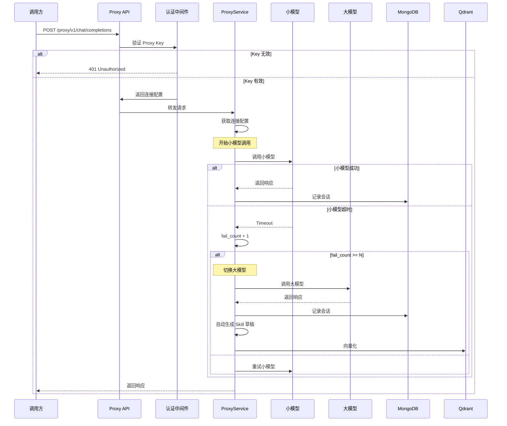

### 1.2 调度策略流程图

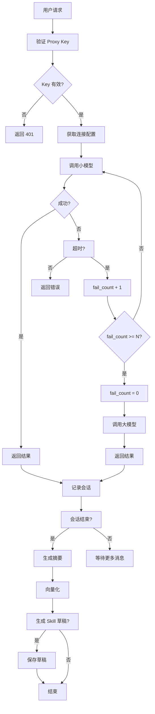

---

## 二、会话管理流程

### 2.1 会话生命周期

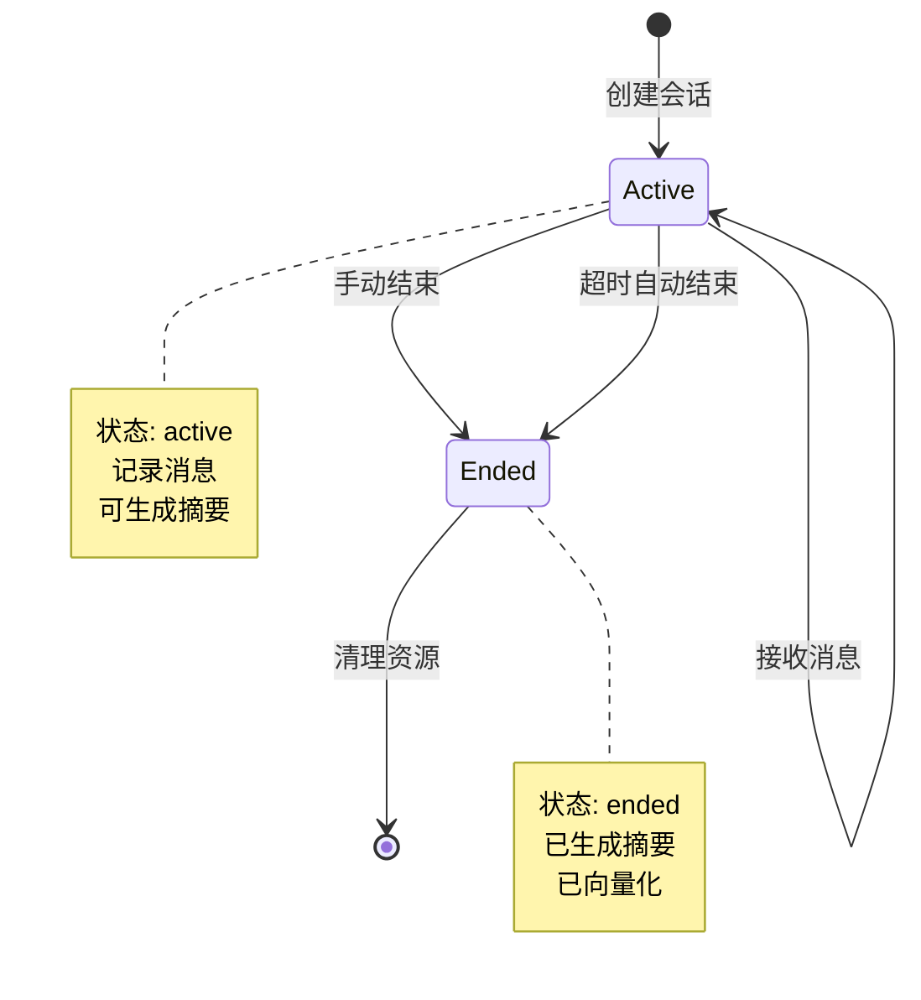

### 2.2 会话 CRUD 流程

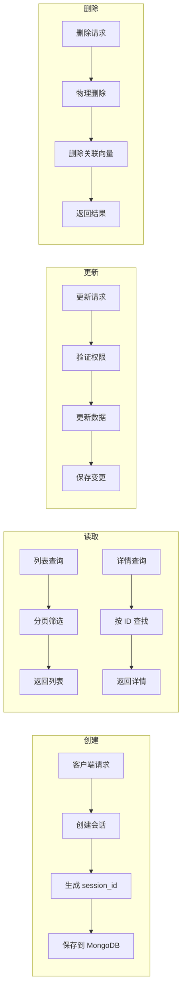

---

## 三、Skill 管理流程

### 3.1 Skill 生成流程

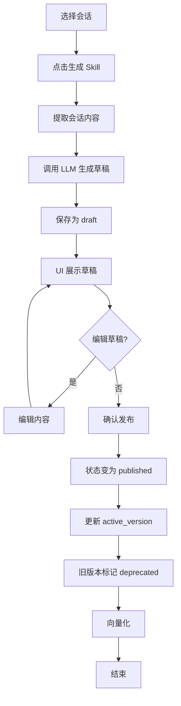

### 3.2 Skill 版本管理

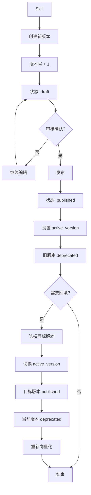

### 3.3 Skill 导入流程

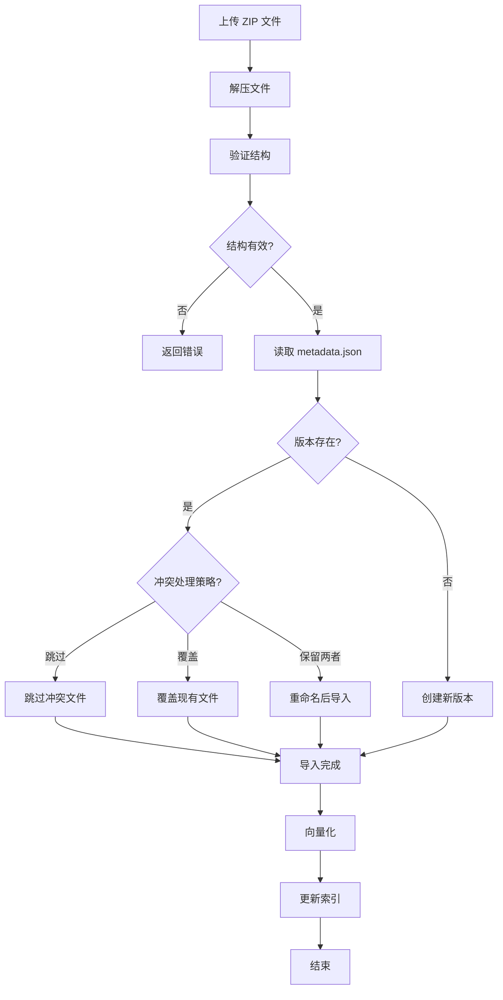

### 3.4 Skill 导出流程

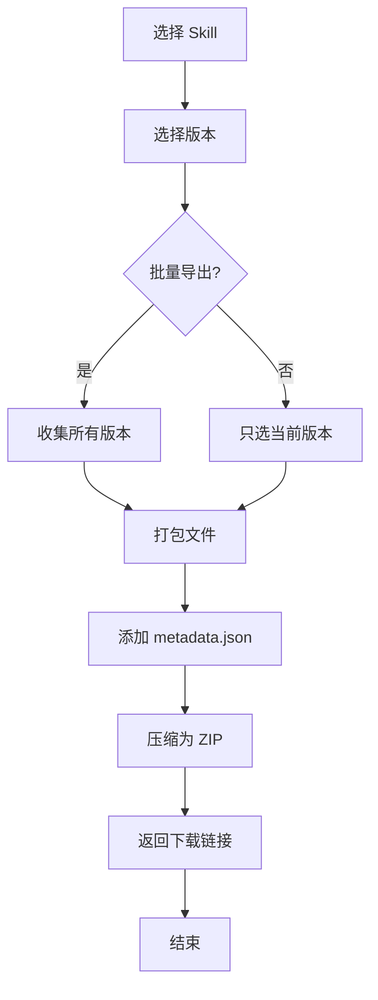

---

## 四、baseskill 管理流程

### 4.1 baseskill 加载流程

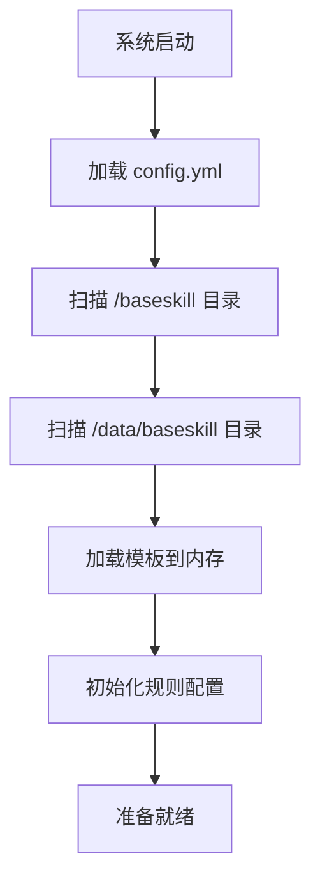

### 4.2 baseskill 添加流程

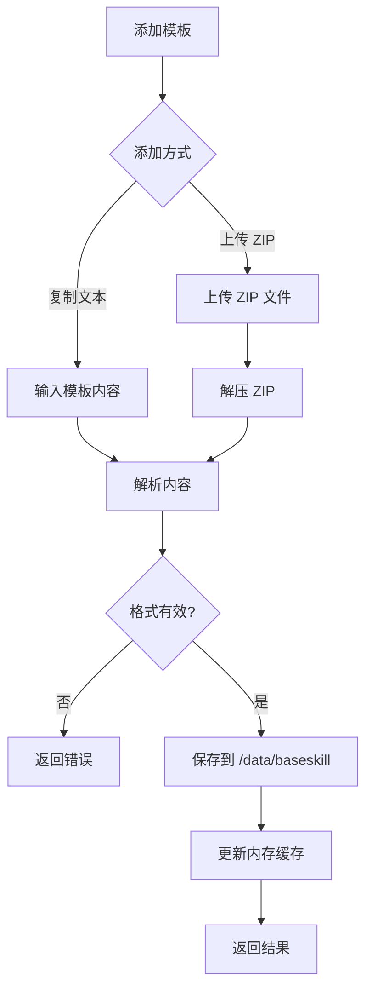

### 4.3 baseskill 调用流程

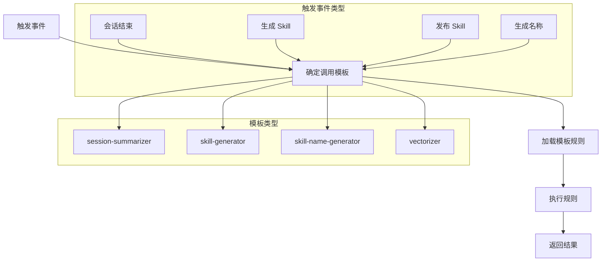

---

## 五、向量存储流程

### 5.1 向量化流程

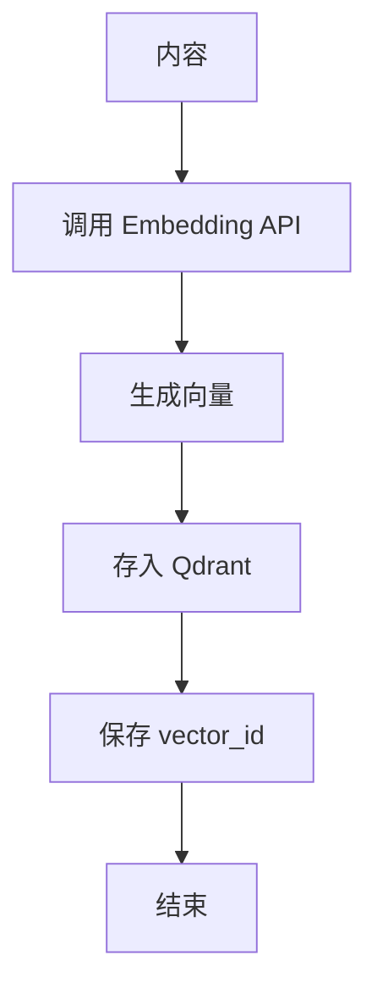

### 5.2 向量检索流程

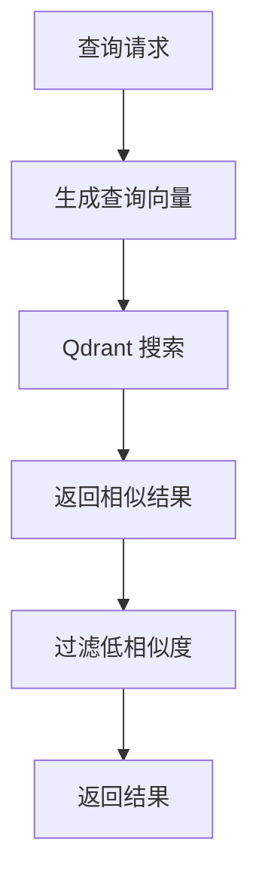

---

## 六、备份恢复流程

### 6.1 备份流程

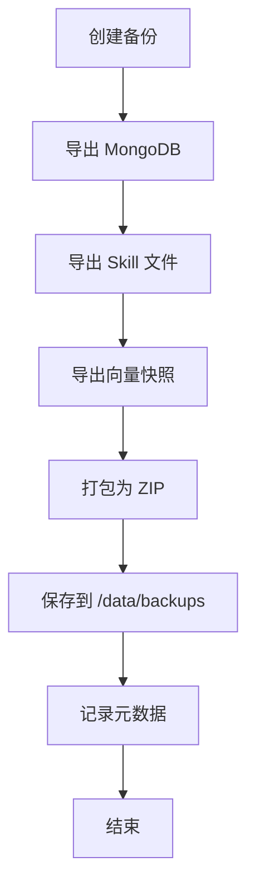

### 6.2 恢复流程

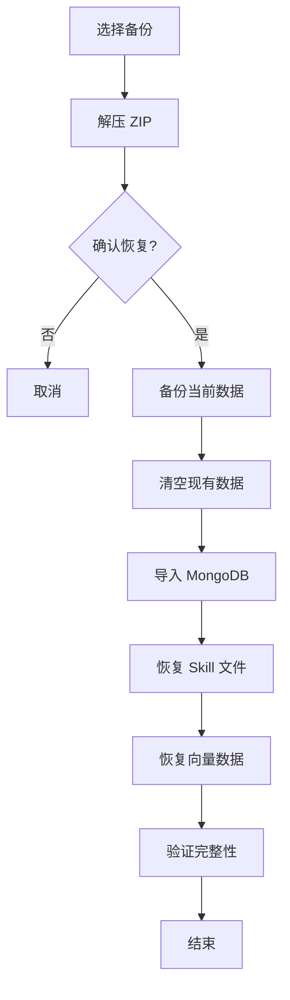

---

## 七、主题切换流程

### 7.1 主题加载

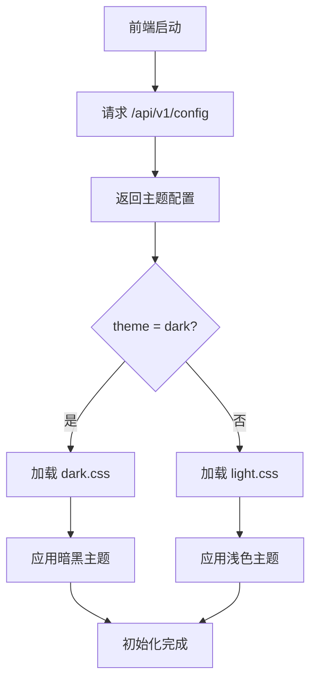

### 7.2 主题切换

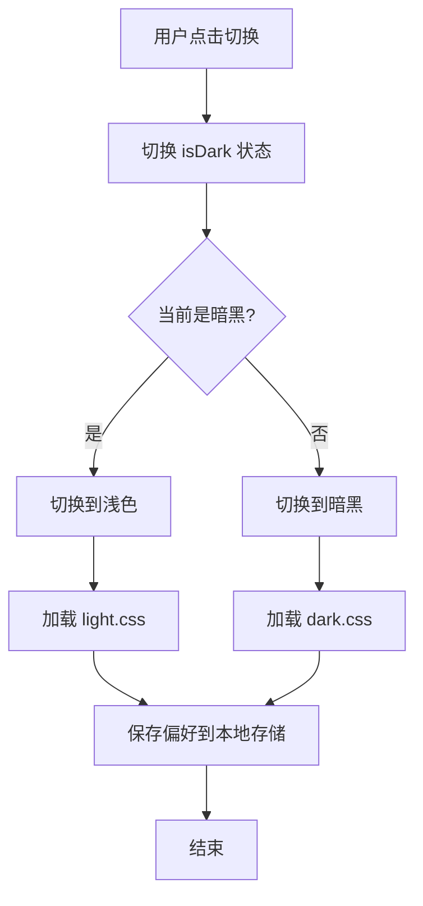

---

## 八、整体架构数据流

```mermaid
flowchart TB
    subgraph External [外部系统]
        Client[调用方]
        Provider[上游供应商]
    end
    
    subgraph ProxySystem [TW AI 节能器]
        direction TB
        
        subgraph API [API 层]
            ProxyAPI[/proxy/v1/*]
            AdminAPI[/api/v1/*]
            WebAPI[/web/v1/*]
        end
        
        subgraph Service [服务层]
            ProxyService[代理服务]
            SessionService[会话服务]
            SkillService[Skill 服务]
            VectorService[向量服务]
            ConfigService[配置服务]
        end
        
        subgraph Domain [领域层]
            ProxyDomain[代理网关]
            SessionDomain[会话管理]
            SkillDomain[Skill 管理]
            VectorDomain[向量存储]
        end
        
        subgraph Infra [基础设施层]
            MongoDB[MongoDB]
            Qdrant[Qdrant]
            Files[文件系统]
            Baseskill[baseskill 模板]
        end
    end
    
    Client --> ProxyAPI
    ProxyAPI --> ProxyService
    ProxyService --> ProxyDomain
    ProxyService --> Provider
    
    AdminAPI --> SessionService
    AdminAPI --> SkillService
    AdminAPI --> VectorService
    AdminAPI --> ConfigService
    
    SessionService --> SessionDomain
    SkillService --> SkillDomain
    VectorService --> VectorDomain
    
    SessionDomain --> MongoDB
    SessionDomain --> Qdrant
    SkillDomain --> Files
    SkillDomain --> Qdrant
    VectorDomain --> Qdrant
    
    SessionService --> Baseskill
    SkillService --> Baseskill
```

---

> 文档状态：**已完成**  
> 参考：开发计划.md、需求分析.md
