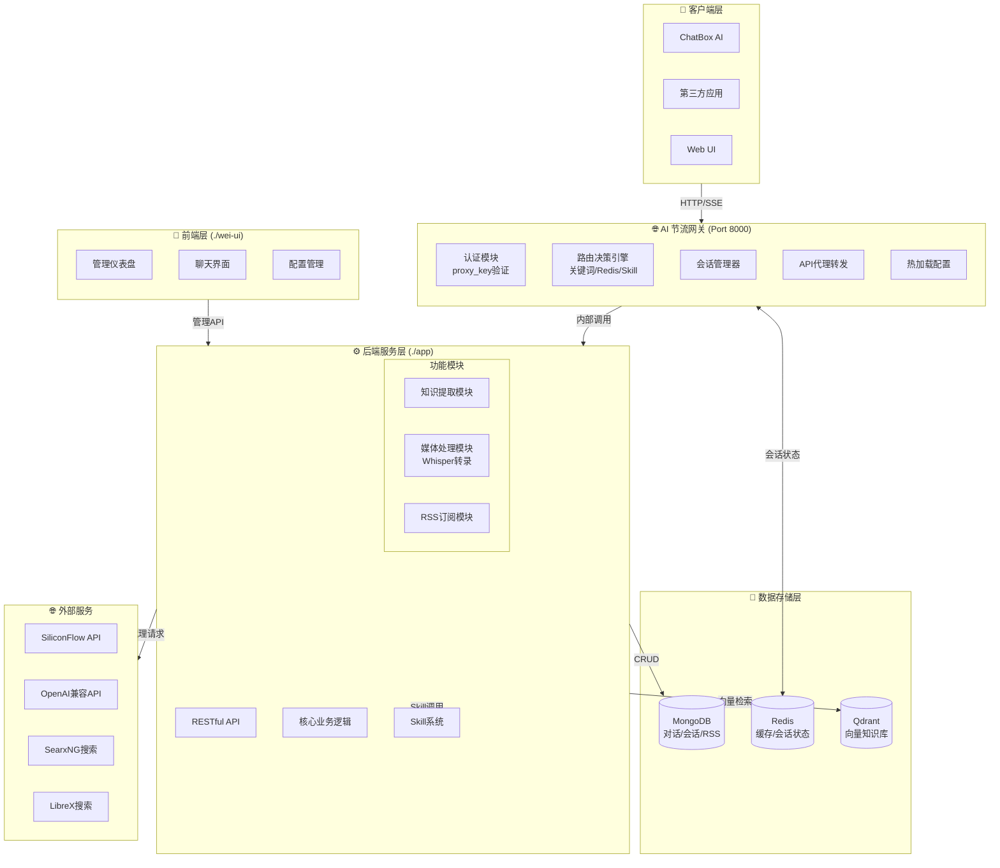
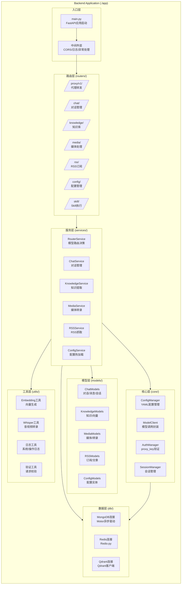
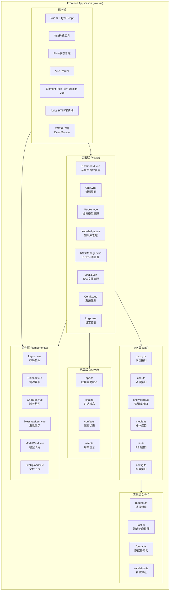
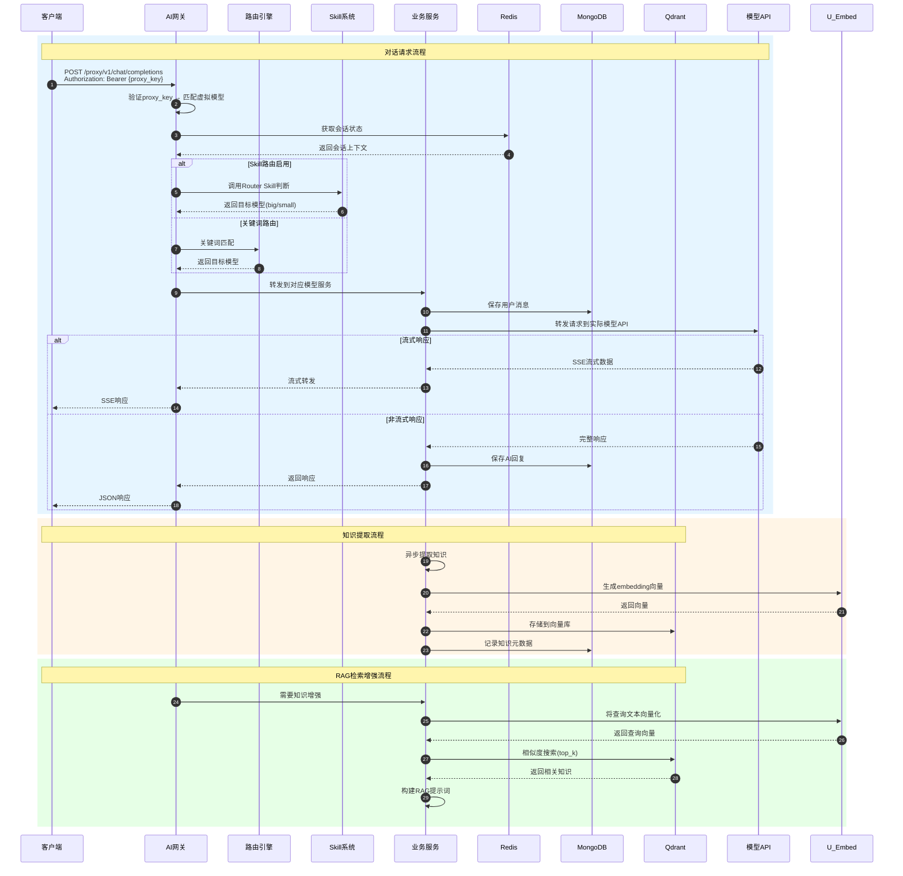
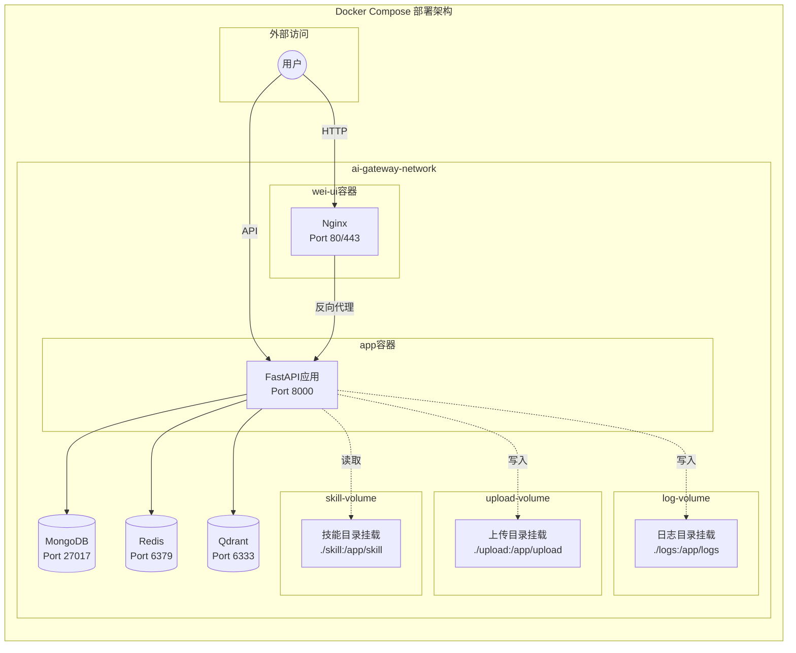
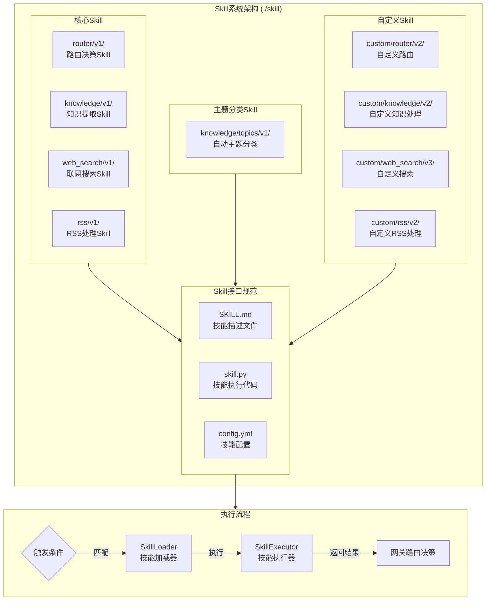

# AI网关系统 - 前后端架构设计

> **Session**: 头脑风暴 Phase 2  
> **目标**: 输出详细前后端架构图，核对需求完整性

---

## 一、系统整体架构图

---

## 二、后端架构详图 (./app)

---

## 三、前端架构详图 (./wei-ui)

---

## 四、数据流架构图

---

## 五、部署架构图 (Docker)

---

## 六、Skill系统架构图

---

## 七、需求核对清单

### ✅ 核心功能覆盖检查

| # | 功能模块 | 需求描述 | 架构支持 | 状态 |
|---|---------|---------|---------|------|
| 1 | **虚拟模型代理** | 复刻SiliconFlow格式，统一API接口 | ✅ Proxy路由层 + ModelClient | 🟢 |
| 2 | **模型路由** | 关键词/Redis会话/Skill智能切换 | ✅ RouterService + Skill系统 | 🟢 |
| 3 | **对话管理** | 会话CRUD，实时保存MongoDB | ✅ ChatService + MongoDB | 🟢 |
| 4 | **知识提取** | 对话/媒体/RSS提取，持久化Qdrant | ✅ KnowledgeService + Qdrant | 🟢 |
| 5 | **媒体处理** | 音视频转文字(Whisper) | ✅ MediaService + Whisper工具 | 🟢 |
| 6 | **RSS订阅** | 自动抓取，提取知识 | ✅ RSSService + 定时任务 | 🟢 |
| 7 | **Skill系统** | 可插拔技能模块 | ✅ SkillLoader + SkillExecutor | 🟢 |
| 8 | **日志系统** | 系统日志+操作日志 | ✅ Logger工具 + 日志目录 | 🟢 |

### ✅ 目录结构核对

| 目录 | 用途 | 状态 |
|-----|------|------|
| `./docker` | 部署文件 | 🟢 架构图已包含 |
| `./logs` | 日志导出 | 🟢 数据流已规划 |
| `./wei-ui` | 前端项目 | 🟢 前端架构详图 |
| `./app` | 后台代码 | 🟢 后端架构详图 |
| `./docs` | 文档目录 | 🟢 本文件存放位置 |
| `./test` | 测试目录 | 🟢 已规划 |
| `./skill` | 技能目录 | 🟢 Skill系统架构 |
| `./upload` | 上传目录 | 🟢 媒体处理支持 |

### ✅ 配置项核对 (config.yml)

| 配置节点 | 用途 | 架构支持 |
|---------|------|---------|
| `app.*` | 服务基础配置 | 🟢 FastAPI启动配置 |
| `storage.mongodb.*` | MongoDB连接 | 🟢 MongoConn模块 |
| `storage.qdrant.*` | Qdrant连接 | 🟢 QdrantConn模块 |
| `storage.redis.*` | Redis连接 | 🟢 RedisConn模块 |
| `ai-gateway.router.*` | 路由配置 | 🟢 RouterService |
| `ai-gateway.virtual_models.*` | 虚拟模型配置 | 🟢 ConfigManager |
| `ai-gateway.knowledge.*` | 知识库配置 | 🟢 KnowledgeService |
| `ai-gateway.rss.*` | RSS配置 | 🟢 RSSService |
| `ai-gateway.media.*` | 媒体配置 | 🟢 MediaService |
| `ai-gateway.log.*` | 日志配置 | 🟢 Logger工具 |

### ✅ 外部服务集成

| 服务类型 | 具体服务 | 集成方式 |
|---------|---------|---------|
| 模型API | SiliconFlow | OpenAI兼容格式代理 |
| 模型API | OpenAI/GPT | 直接代理 |
| 搜索服务 | SearxNG | WebSearch Skill |
| 搜索服务 | LibreX | WebSearch Skill |
| 搜索服务 | 4get | WebSearch Skill |

---

## 八、待确认问题

### 🔍 需要您确认的设计决策：

1. **前端技术栈选择**
   - 推荐：Vue 3 + TypeScript + Element Plus
   - 备选：React + TypeScript + Ant Design
   - 您的偏好是？

2. **Whisper处理器选择**
   - 开发环境(无显卡32G)：faster_whisper (CPU模式)
   - 部署环境(AMD aimax 395 96G显存)：whisper_npu 或 faster_whisper (GPU模式)
   - 是否需要同时支持CPU/GPU自动检测？

3. **Skill系统执行方式**
   - 选项A: Python函数动态加载 (推荐，简单高效)
   - 选项B: 独立进程/微服务 (复杂但隔离性好)
   - 您的选择？

4. **Web搜索Skill实现**
   - SearxNG/LibreX/4get 是通过API调用还是直接集成搜索逻辑？
   - 是否需要支持多搜索引擎结果聚合？

5. **文件上传大小限制**
   - 视频：100MB (当前配置)
   - 音频：100MB (当前配置)
   - 是否需要支持更大文件的分片上传？

---

## 九、下一步建议

确认以上问题后，建议按以下顺序进行：

1. **Phase 3**: 数据库Schema设计 (MongoDB Collections + Qdrant Collections)
2. **Phase 4**: API接口规范设计 (OpenAPI/Swagger文档)
3. **Phase 5**: Skill系统接口规范详细设计
4. **Phase 6**: 项目初始化和开发计划

---

**以上架构是否满足您的需求？请确认或提出修改意见。**
