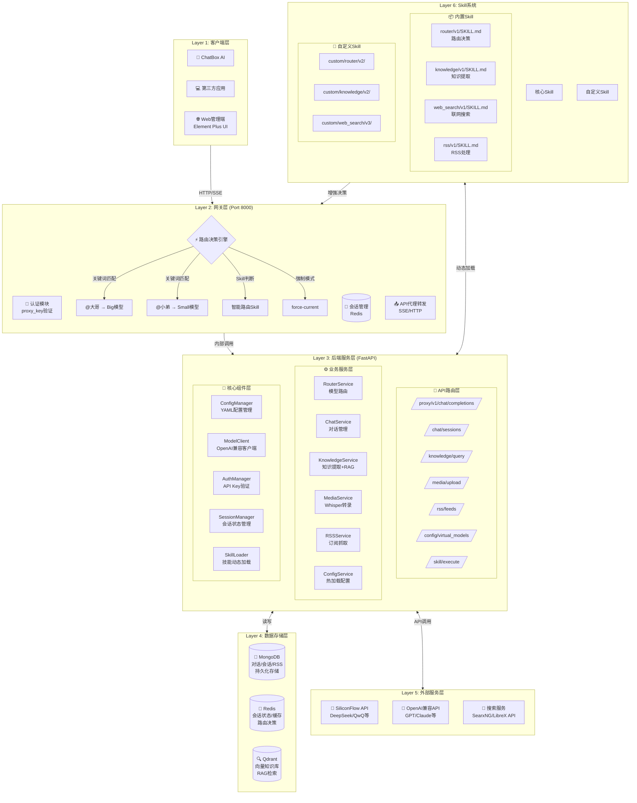

# AI网关系统 - UI设计图 & 审核版架构图

> **审核版本**: v1.0  
> **确认配置**:
> - 前端: Vue3 + TypeScript + Element Plus
> - Whisper: CPU开发模式 + GPU部署模式
> - Skill: Python函数动态加载
> - Web搜索: API调用方式
> - 上传限制: 100MB (不分片)

---

## 一、整体系统架构图（审核版）



---

## 二、UI界面设计图

### 2.1 登录页

```
┌─────────────────────────────────────────────────────────────┐
│                                                             │
│                    🤖 AI 节流网关                           │
│                 AI Gateway Management                       │
│                                                             │
│    ┌─────────────────────────────────────────────────┐     │
│    │                                                 │     │
│    │              🔐 管理员登录                      │     │
│    │                                                 │     │
│    │    用户名                                      │     │
│    │    ┌──────────────────────────────────────┐   │     │
│    │    │ admin@example.com                    │   │     │
│    │    └──────────────────────────────────────┘   │     │
│    │                                                 │     │
│    │    密码                                        │     │
│    │    ┌──────────────────────────────────────┐   │     │
│    │    │ ●●●●●●●●●●●●                         │   │     │
│    │    └──────────────────────────────────────┘   │     │
│    │                                                 │     │
│    │    ☑️ 记住我                                    │     │
│    │                                                 │     │
│    │    ┌──────────────────────────────────────┐   │     │
│    │    │         🚀 登 录                      │   │     │
│    │    └──────────────────────────────────────┘   │     │
│    │                                                 │     │
│    └─────────────────────────────────────────────────┘     │
│                                                             │
│              © 2026 AI Gateway - v1.0.0                    │
└─────────────────────────────────────────────────────────────┘
```

---

### 2.2 仪表盘首页 (Dashboard)

```
┌──────────────────────────────────────────────────────────────────────────────┐
│ 🏠 Dashboard                    🔍 全局搜索...          🔔 ⚙️ 👤 Admin ▼  │
├──────────┬───────────────────────────────────────────────────────────────────┤
│          │                                                                   │
│ 🤖 AI    │  📊 系统概览                                        [刷新]       │
│  Gateway │  ━━━━━━━━━━━━━━━━━━━━━━━━━━━━━━━━━━━━━━━━━━━━━━━━━━━━━━━━━━━━━━ │
│          │                                                                   │
│ 📊 仪表盘 │  ┌──────────────┐ ┌──────────────┐ ┌──────────────┐ ┌────────┐ │
│          │  │ 📈 今日请求   │ │ 💬 活跃会话   │ │ 📚 知识条目   │ │ ⚡ 模型  │ │
│ 💬 对话   │  │              │ │              │ │              │ │        │ │
│  管理    │  │   12,458    │ │     89      │ │   3,421     │ │ Small  │ │
│          │  │   ↑ 15%     │ │   ↑ 8%      │ │   ↑ 23%     │ │  78%   │ │
│ 🤖 模型   │  └──────────────┘ └──────────────┘ └──────────────┘ └────────┘ │
│  管理    │                                                                   │
│          │  ┌─────────────────────────────┐ ┌─────────────────────────────┐ │
│ 📚 知识   │  │ 📊 请求趋势 (近7天)          │ │ 🥧 模型使用占比              │ │
│  库     │  │                              │ │                              │ │
│          │  │    📈                        │ │     ┌──────────┐            │ │
│ 📡 RSS  │  │   /│\                       │ │     │  Small   │ 65%       │ │
│  订阅    │  │  / │ \    /\                │ │     │  ██████  │            │ │
│          │  │ /  │  \  /  \      /\       │ │     │  Big     │ 35%       │ │
│ 📁 媒体   │  │/   │   \/    \    /  \      │ │     │  ███     │            │ │
│  管理    │  │    │          \  /    \     │ │     └──────────┘            │ │
│          │  │    │           \/      \    │ │                              │ │
│ 📝 系统   │  │ Mon  Tue  Wed  Thu  Fri     │ │                              │ │
│  日志    │  └─────────────────────────────┘ └─────────────────────────────┘ │
│          │                                                                   │
│ ⚙️ 配置   │  ┌─────────────────────────────┐ ┌─────────────────────────────┐ │
│  管理    │  │ 🚨 系统状态                  │ │ 📡 RSS订阅状态               │ │
│          │  │                              │ │                              │ │
│          │  │ 🟢 MongoDB    正常           │ │ 🟢 AI科技日报   5分钟前更新   │ │
│          │  │ 🟢 Redis      正常           │ │ 🟢 技术博客     1小时前更新   │ │
│          │  │ 🟢 Qdrant     正常           │ │ 🟡 新闻资讯     待更新        │ │
│          │  │ 🟢 Skill系统  正常           │ │                              │ │
│          │  │                              │ │ [管理RSS订阅 →]              │ │
│          │  └─────────────────────────────┘ └─────────────────────────────┘ │
│          │                                                                   │
└──────────┴───────────────────────────────────────────────────────────────────┘
```

---

### 2.3 对话管理界面

```
┌──────────────────────────────────────────────────────────────────────────────┐
│ 💬 对话管理                     🔍 搜索会话...          🔔 ⚙️ 👤 Admin ▼  │
├──────────┬───────────────────────────────────────────────────────────────────┤
│          │                                                                   │
│ 会话列表  │  ┌───────────────────────────────────────────────────────────┐   │
│          │  │ 🤖 会话: chat_session_001        🕐 2分钟前      [×]       │   │
│ 🔍 搜索  │  └───────────────────────────────────────────────────────────┘   │
│          │                                                                   │
│ ┌──────┐ │  ┌───────────────────────────────────────────────────────────┐   │
│ │ 全部 │ │  │ 👤 用户: 如何实现模型路由切换？                          │   │
│ ├──────┤ │  │ 🕐 10:23                                                  │   │
│ │活跃 │ │  └───────────────────────────────────────────────────────────┘   │
│ ├──────┤ │                                                                   │
│ │已归档│ │  ┌───────────────────────────────────────────────────────────┐   │
│ └──────┘ │  │ 🤖 AI: 您可以通过以下方式实现模型路由...                  │   │
│          │  │                                                           │   │
│ 会话1   │  │ 1. 关键词路由: 使用@大哥/@小弟触发                        │   │
│ ├─会话2│  │ 2. Skill路由: 配置router/v1/SKILL.md                     │   │
│ ├─会话3│  │ 3. Redis会话: 根据会话历史自动判断                        │   │
│ ├─会话4│  │                                                           │   │
│          │  │ 🕐 10:23:05              👍 👎 🔄                         │   │
│          │  └───────────────────────────────────────────────────────────┘   │
│          │                                                                   │
│ [+新建]  │  ┌───────────────────────────────────────────────────────────┐   │
│          │  │ 👤 用户: @大哥 帮我写一段Python代码                       │   │
│          │  └───────────────────────────────────────────────────────────┘   │
│          │                                                                   │
│          │  ┌───────────────────────────────────────────────────────────┐   │
│          │  │ 🤖 AI: [已切换至Big模型 - DeepSeek-V3.2]                   │   │
│          │  │ ```python                                                 │   │
│          │  │ def route_model(query, session_history):                  │   │
│          │  │     # 模型路由逻辑                                        │   │
│          │  │     if "@大哥" in query:                                  │   │
│          │  │         return "big"                                      │   │
│          │  │     # ...                                                 │   │
│          │  │ ```                                                       │   │
│          │  └───────────────────────────────────────────────────────────┘   │
│          │                                                                   │
│          │  ━━━━━━━━━━━━━━━━━━━━━━━━━━━━━━━━━━━━━━━━━━━━━━━━━━━━━━━━━━━━━━ │
│          │                                                                   │
│          │  ┌───────────────────────────────────────────────────────────┐   │
│          │  │ 💬 输入消息...                               📎 🎤 ➤     │   │
│          │  └───────────────────────────────────────────────────────────┘   │
│          │                                                                   │
└──────────┴───────────────────────────────────────────────────────────────────┘
```

---

### 2.4 虚拟模型管理界面

```
┌──────────────────────────────────────────────────────────────────────────────┐
│ 🤖 模型管理                     🔍 搜索模型...          🔔 ⚙️ 👤 Admin ▼  │
├──────────┬───────────────────────────────────────────────────────────────────┤
│          │                                                                   │
│          │  ┌───────────────────────────────────────────────────────────┐   │
│ 模型列表  │  │ 🤖 虚拟模型管理                              [+ 新建模型]  │   │
│          │  └───────────────────────────────────────────────────────────┘   │
│          │                                                                   │
│ ┌──────┐ │  ┌───────────────────────────────────────────────────────────┐   │
│ │ 全部 │ │  │                                                             │   │
│ ├──────┤ │  │  🏷️ demo1                                    🟢 启用中      │   │
│ │启用中│ │  │  ━━━━━━━━━━━━━━━━━━━━━━━━━━━━━━━━━━━━━━━━━━━━━━━━━━━━━━━  │   │
│ ├──────┤ │  │                                                             │   │
│ │已禁用│ │  │  📍 Base URL: http://192.168.1.100:8000/proxy/v1         │   │
│ └──────┘ │  │  🔑 Proxy Key: sk-xxx...xxx (点击复制)                    │   │
│          │  │                                                             │   │
│          │  │  ┌─────────────────┐    ┌─────────────────┐                │   │
│ demo1   │  │  │ ⚡ Small模型     │    │ 🚀 Big模型       │                │   │
│ demo2   │  │  │                 │    │                 │                │   │
│ demo3   │  │  │ Model: DeepSeek │    │ Model: DeepSeek │                │   │
│         │  │  │       -R1-0528  │    │       -V3.2     │                │   │
│         │  │  │ Status: 🟢 当前  │    │ Status: ⚪       │                │   │
│         │  │  │ [设为Big]       │    │ [设为当前]      │                │   │
│         │  │  └─────────────────┘    └─────────────────┘                │   │
│         │  │                                                             │   │
│         │  │  📚 知识库: 🟢 启用  │  🔍 联网搜索: 🟢 启用                 │   │
│         │  │                                                             │   │
│         │  │  [✏️ 编辑] [🔧 配置] [📊 统计] [🚫 禁用]                  │   │
│         │  └───────────────────────────────────────────────────────────┘   │
│         │                                                                   │
│         │  ┌───────────────────────────────────────────────────────────┐   │
│         │  │                                                             │   │
│         │  │  🏷️ demo2                                    ⚪ 已禁用      │   │
│         │  │  ━━━━━━━━━━━━━━━━━━━━━━━━━━━━━━━━━━━━━━━━━━━━━━━━━━━━━━━  │   │
│         │  │                                                             │   │
│         │  │  📍 Base URL: http://192.168.1.100:8000/proxy/v1         │   │
│         │  │                                                             │   │
│         │  │  [✏️ 编辑] [🔧 配置] [🗑️ 删除]                          │   │
│         │  └───────────────────────────────────────────────────────────┘   │
│         │                                                                   │
└─────────┴───────────────────────────────────────────────────────────────────┘
```

---

### 2.5 模型配置编辑弹窗

```
┌──────────────────────────────────────────────────────────────┐
│ ✏️ 编辑虚拟模型 - demo1                          [×]         │
├──────────────────────────────────────────────────────────────┤
│                                                              │
│  基本信息                                                    │
│  ━━━━━━━━━━━━━━━━━━━━━━━━━━━━━━━━━━━━━━━━━━━━━━━━━━━━━━━━━━│
│                                                              │
│  虚拟模型名称 *                                              │
│  ┌────────────────────────────────────────────────────────┐ │
│  │ demo1                                                  │ │
│  └────────────────────────────────────────────────────────┘ │
│                                                              │
│  Proxy Key                                                   │
│  ┌────────────────────────────────────────────────────────┐ │
│  │ sk-xxxxxxxxxxxxxxxxxxxxx    [🔄 重新生成]              │ │
│  └────────────────────────────────────────────────────────┘ │
│                                                              │
│  启用状态                                                    │
│  ━━━━━━━━━━━━━━━━━━━━━━━━━━━━━━━━━━━━━━━━━━━━━━━━━━━━━━━━━━│
│                                                              │
│  ☑️ 启用此虚拟模型                                           │
│  ○ 强制使用当前模型 (force-current)                          │
│                                                              │
│  模型配置                                                    │
│  ━━━━━━━━━━━━━━━━━━━━━━━━━━━━━━━━━━━━━━━━━━━━━━━━━━━━━━━━━━│
│                                                              │
│  Small模型配置                                               │
│  ┌────────────────────────────────────────────────────────┐ │
│  │ 模型名称: deepseek-ai/DeepSeek-R1-0528-Qwen3-8B       │ │
│  │ API Key: sk-xxxxxxxxxxxxxxxxxxxxx                      │ │
│  │ Base URL: https://api.siliconflow.cn/v1                │ │
│  └────────────────────────────────────────────────────────┘ │
│                                                              │
│  Big模型配置                                                 │
│  ┌────────────────────────────────────────────────────────┐ │
│  │ 模型名称: Pro/deepseek-ai/DeepSeek-V3.2               │ │
│  │ API Key: sk-xxxxxxxxxxxxxxxxxxxxx                      │ │
│  │ Base URL: https://api.siliconflow.cn/v1                │ │
│  └────────────────────────────────────────────────────────┘ │
│                                                              │
│  功能开关                                                    │
│  ━━━━━━━━━━━━━━━━━━━━━━━━━━━━━━━━━━━━━━━━━━━━━━━━━━━━━━━━━━│
│                                                              │
│  ☑️ 启用知识库    ☑️ 共享知识库                              │
│  ☑️ 启用联网搜索                                              │
│                                                              │
│  路由配置                                                    │
│  ━━━━━━━━━━━━━━━━━━━━━━━━━━━━━━━━━━━━━━━━━━━━━━━━━━━━━━━━━━│
│                                                              │
│  ☑️ 启用Skill路由                                            │
│  ☑️ 启用关键词路由                                            │
│  │ @大哥 → Big模型                                          │ │
│  │ @小弟 → Small模型                                        │ │
│                                                              │
├──────────────────────────────────────────────────────────────┤
│                                    [取消]  [💾 保存配置]     │
└──────────────────────────────────────────────────────────────┘
```

---

### 2.6 知识库管理界面

```
┌──────────────────────────────────────────────────────────────────────────────┐
│ 📚 知识库                       🔍 搜索知识...          🔔 ⚙️ 👤 Admin ▼  │
├──────────┬───────────────────────────────────────────────────────────────────┤
│          │                                                                   │
│ 知识分类  │  ┌───────────────────────────────────────────────────────────┐   │
│          │  │ 📚 知识库管理                                               │   │
│ 🔍 全部  │  │ ━━━━━━━━━━━━━━━━━━━━━━━━━━━━━━━━━━━━━━━━━━━━━━━━━━━━━━━━━ │   │
│          │  │                                                             │   │
│ 📁 项目  │  │ 统计: 总计 3,421 条 │ 今日新增 23 条 │ 存储 128MB         │   │
│  架构    │  │                                                             │   │
│ 📁 用户  │  │  ┌─────────────┐ ┌─────────────┐ ┌─────────────┐           │   │
│  偏好    │  │  │ 📊 项目架构  │ │ 👤 用户偏好  │ │ 📋 开发规范  │           │   │
│ 📁 开发  │  │  │    523条    │ │    189条    │ │    67条     │           │   │
│  规范    │  │  └─────────────┘ └─────────────┘ └─────────────┘           │   │
│          │  │                                                             │   │
│ 🔖 标签  │  │ [+ 新增知识] [📤 批量导入] [🔄 重新索引]                    │   │
│          │  └───────────────────────────────────────────────────────────┘   │
│          │                                                                   │
│          │  ┌───────────────────────────────────────────────────────────┐   │
│          │  │ 🔍 知识检索测试                                             │   │
│          │  │ ━━━━━━━━━━━━━━━━━━━━━━━━━━━━━━━━━━━━━━━━━━━━━━━━━━━━━━━━━ │   │
│          │  │                                                             │   │
│          │  │ ┌─────────────────────────────────────────────────────┐   │   │
│          │  │ │ 输入查询内容...                              [🔍 搜索]│   │   │
│          │  │ └─────────────────────────────────────────────────────┘   │   │
│          │  │                                                             │   │
│          │  │ 检索结果:                                                   │   │
│          │  │ ┌────────────────────────────────────────────────────────┐│   │
│          │  │ │ 📄 系统架构设计 (相似度: 0.92)                          ││   │
│          │  │ │ 系统采用分层架构设计，包括网关层、服务层...             ││   │
│          │  │ │ 📁 项目架构  │  🕐 2026-02-01                          ││   │
│          │  │ ├────────────────────────────────────────────────────────┤│   │
│          │  │ │ 📄 微服务拆分原则 (相似度: 0.85)                        ││   │
│          │  │ │ 按业务领域进行服务拆分，每个服务独立部署...             ││   │
│          │  │ │ 📁 项目架构  │  🕐 2026-01-28                          ││   │
│          │  │ ├────────────────────────────────────────────────────────┤│   │
│          │  │ │ 📄 API网关设计 (相似度: 0.78)                           ││   │
│          │  │ │ 网关负责统一入口、认证、路由等功能...                   ││   │
│          │  │ │ 📁 项目架构  │  🕐 2026-01-25                          ││   │
│          │  │ └────────────────────────────────────────────────────────┘│   │
│          │  │                                                             │   │
│          │  └───────────────────────────────────────────────────────────┘   │
│          │                                                                   │
│          │  ┌───────────────────────────────────────────────────────────┐   │
│          │  │ 📋 最近添加的知识                                           │   │
│          │  │ ━━━━━━━━━━━━━━━━━━━━━━━━━━━━━━━━━━━━━━━━━━━━━━━━━━━━━━━━━ │   │
│          │  │                                                             │   │
│          │  │ • 对话 #chat_001 - 已提取 5 条知识    🕐 5分钟前           │   │
│          │  │ • RSS - AI科技日报 - 已提取 3 条文章  🕐 30分钟前          │   │
│          │  │ • 视频 - meeting_001.mp4 - 转录完成   🕐 2小时前           │   │
│          │  │                                                             │   │
│          │  └───────────────────────────────────────────────────────────┘   │
│          │                                                                   │
└──────────┴───────────────────────────────────────────────────────────────────┘
```

---

### 2.7 RSS订阅管理界面

```
┌──────────────────────────────────────────────────────────────────────────────┐
│ 📡 RSS订阅                      🔍 搜索...              🔔 ⚙️ 👤 Admin ▼  │
├──────────┬───────────────────────────────────────────────────────────────────┤
│          │                                                                   │
│ 订阅列表  │  ┌───────────────────────────────────────────────────────────┐   │
│          │  │ 📡 RSS订阅管理                                [+ 添加订阅] │   │
│ 🟢 AI   │  └───────────────────────────────────────────────────────────┘   │
│  科技   │                                                                   │
│         │  ┌───────────────────────────────────────────────────────────┐   │
│ 🟢 技术 │  │ 📰 AI科技日报                                               │   │
│  博客   │  │ ━━━━━━━━━━━━━━━━━━━━━━━━━━━━━━━━━━━━━━━━━━━━━━━━━━━━━━━━━ │   │
│         │  │                                                             │   │
│ 🟡 新闻 │  │ URL: https://blog.example.com/feed.xml                     │   │
│  资讯   │  │ 状态: 🟢 正常  │  更新频率: 每30分钟                         │   │
│         │  │ 最后更新: 5分钟前  │  已抓取: 156篇文章                      │   │
│         │  │                                                             │   │
│ ⚙️ 设置 │  │ 配置: ☑️ 自动抓取  ☑️ 提取知识  ☑️ 永久保存                │   │
│         │  │                                                             │   │
│         │  │ [📄 查看文章] [🔄 立即更新] [✏️ 编辑] [🗑️ 删除]           │   │
│         │  └───────────────────────────────────────────────────────────┘   │
│         │                                                                   │
│         │  ┌───────────────────────────────────────────────────────────┐   │
│         │  │ 📰 技术博客精选                                             │   │
│         │  │ ━━━━━━━━━━━━━━━━━━━━━━━━━━━━━━━━━━━━━━━━━━━━━━━━━━━━━━━━━ │   │
│         │  │                                                             │   │
│         │  │ URL: https://tech.blog.com/rss.xml                         │   │
│         │  │ 状态: 🟢 正常  │  更新频率: 每60分钟                         │   │
│         │  │ 最后更新: 1小时前  │  已抓取: 89篇文章                       │   │
│         │  │                                                             │   │
│         │  │ [📄 查看文章] [🔄 立即更新] [✏️ 编辑] [🗑️ 删除]           │   │
│         │  └───────────────────────────────────────────────────────────┘   │
│         │                                                                   │
│         │  ┌───────────────────────────────────────────────────────────┐   │
│         │  │ 📰 新闻资讯                                                 │   │
│         │  │ ━━━━━━━━━━━━━━━━━━━━━━━━━━━━━━━━━━━━━━━━━━━━━━━━━━━━━━━━━ │   │
│         │  │                                                             │   │
│         │  │ URL: https://news.ai.com/rss                               │   │
│         │  │ 状态: 🟡 警告  │  更新频率: 每30分钟                         │   │
│         │  │ 最后更新: 3小时前  │  已抓取: 234篇文章                      │   │
│         │  │ 警告: 上次更新失败，请检查URL                               │   │
│         │  │                                                             │   │
│         │  │ [📄 查看文章] [🔄 立即更新] [✏️ 编辑] [🗑️ 删除]           │   │
│         │  └───────────────────────────────────────────────────────────┘   │
│         │                                                                   │
└─────────┴───────────────────────────────────────────────────────────────────┘
```

---

### 2.8 媒体文件管理界面

```
┌──────────────────────────────────────────────────────────────────────────────┐
│ 📁 媒体管理                     🔍 搜索文件...          🔔 ⚙️ 👤 Admin ▼  │
├──────────┬───────────────────────────────────────────────────────────────────┤
│          │                                                                   │
│ 📂 文件   │  ┌───────────────────────────────────────────────────────────┐   │
│  类型    │  │ 📁 媒体文件管理                               [📤 上传文件] │   │
│          │  └───────────────────────────────────────────────────────────┘   │
│ 🎥 视频  │                                                                   │
│          │  ┌───────────────────────────────────────────────────────────┐   │
│ 🎵 音频  │  │ 📤 上传新文件                                               │   │
│          │  │ ━━━━━━━━━━━━━━━━━━━━━━━━━━━━━━━━━━━━━━━━━━━━━━━━━━━━━━━━━ │   │
│ 📊 统计  │  │                                                             │   │
│          │  │ 支持格式: MP4, AVI, MOV, MP3, WAV, OGG                      │   │
│          │  │ 最大文件: 100MB                                             │   │
│          │  │                                                             │   │
│          │  │ ┌─────────────────────────────────────────────────────┐   │   │
│          │  │ │ 📂 拖拽文件到此处 或 点击选择文件                     │   │   │
│          │  │ │                                                     │   │   │
│          │  │ │          ⬆️                                         │   │   │
│          │  │ │                                                     │   │   │
│          │  │ └─────────────────────────────────────────────────────┘   │   │
│          │  │                                                             │   │
│          │  └───────────────────────────────────────────────────────────┘   │
│          │                                                                   │
│          │  ┌───────────────────────────────────────────────────────────┐   │
│          │  │ 🎥 视频文件 (3)                                           │   │
│          │  │ ━━━━━━━━━━━━━━━━━━━━━━━━━━━━━━━━━━━━━━━━━━━━━━━━━━━━━━━━━ │   │
│          │  │                                                             │   │
│          │  │ ┌──────────┬─────────────┬──────────┬──────────┬────────┐ │   │
│          │  │ │ 🎬       │ meeting_001 │ 45.2MB   │ ✅ 转录   │ [播放] │ │   │
│          │  │ │          │ .mp4        │ 15:32    │    完成   │ [⬇️]   │ │   │
│          │  │ ├──────────┼─────────────┼──────────┼──────────┼────────┤ │   │
│          │  │ │ 🎬       │ lecture_002 │ 78.5MB   │ ⏳ 转录   │ [等待] │ │   │
│          │  │ │          │ .mp4        │ 32:15    │    中...  │ [⬇️]   │ │   │
│          │  │ ├──────────┼─────────────┼──────────┼──────────┼────────┤ │   │
│          │  │ │ 🎬       │ demo_003    │ 23.1MB   │ 📝 待转录 │ [开始] │ │   │
│          │  │ │          │ .avi        │ 12:08    │           │ [⬇️]   │ │   │
│          │  │ └──────────┴─────────────┴──────────┴──────────┴────────┘ │   │
│          │  │                                                             │   │
│          │  └───────────────────────────────────────────────────────────┘   │
│          │                                                                   │
│          │  ┌───────────────────────────────────────────────────────────┐   │
│          │  │ 🎵 音频文件 (2)                                           │   │
│          │  │ ━━━━━━━━━━━━━━━━━━━━━━━━━━━━━━━━━━━━━━━━━━━━━━━━━━━━━━━━━ │   │
│          │  │                                                             │   │
│          │  │ ┌──────────┬─────────────┬──────────┬──────────┬────────┐ │   │
│          │  │ │ 🎵       │ podcast_001 │ 28.5MB   │ ✅ 转录   │ [播放] │ │   │
│          │  │ │          │ .mp3        │ 45:20    │    完成   │ [⬇️]   │ │   │
│          │  │ ├──────────┼─────────────┼──────────┼──────────┼────────┤ │   │
│          │  │ │ 🎵       │ interview   │ 15.2MB   │ ✅ 转录   │ [播放] │ │   │
│          │  │ │          │ _002.wav     │ 22:10    │    完成   │ [⬇️]   │ │   │
│          │  │ └──────────┴─────────────┴──────────┴──────────┴────────┘ │   │
│          │  │                                                             │   │
│          │  └───────────────────────────────────────────────────────────┘   │
│          │                                                                   │
└──────────┴───────────────────────────────────────────────────────────────────┘
```

---

### 2.9 系统配置管理界面

```
┌──────────────────────────────────────────────────────────────────────────────┐
│ ⚙️ 系统配置                     🔍 搜索配置项...        🔔 ⚙️ 👤 Admin ▼  │
├──────────┬───────────────────────────────────────────────────────────────────┤
│          │                                                                   │
│ 📋 配置   │  ┌───────────────────────────────────────────────────────────┐   │
│  分类    │  │ ⚙️ 系统配置管理                                             │   │
│          │  │ ━━━━━━━━━━━━━━━━━━━━━━━━━━━━━━━━━━━━━━━━━━━━━━━━━━━━━━━━━ │   │
│ 🌐 基础   │  │                                                             │   │
│  配置    │  │ ⚠️ 警告: config.yml 只能通过后台接口修改，直接编辑无效     │   │
│          │  │                                                             │   │
│ 💾 存储   │  └───────────────────────────────────────────────────────────┘   │
│  配置    │                                                                   │
│          │  ┌───────────────────────────────────────────────────────────┐   │
│ 🤖 模型   │  │ 🌐 基础配置                                                 │   │
│  配置    │  │ ━━━━━━━━━━━━━━━━━━━━━━━━━━━━━━━━━━━━━━━━━━━━━━━━━━━━━━━━━ │   │
│          │  │                                                             │   │
│ 📚 知识   │  │ 服务监听地址                                                │   │
│  库     │  │ ┌────────────────────────────────────────────────────────┐│   │
│          │  │ │ 0.0.0.0:8000                                           ││   │
│ 📡 RSS  │  │ └────────────────────────────────────────────────────────┘│   │
│  配置    │  │                                                             │   │
│          │  │ Debug模式                                                   │   │
│ 📁 媒体   │  │ ○ 开启  ● 关闭                                             │   │
│  配置    │  │                                                             │   │
│          │  └───────────────────────────────────────────────────────────┘   │
│ 📝 日志   │  │                                                             │   │
│  配置    │  ┌───────────────────────────────────────────────────────────┐   │
│          │  │ 💾 存储配置                                                 │   │
│          │  │ ━━━━━━━━━━━━━━━━━━━━━━━━━━━━━━━━━━━━━━━━━━━━━━━━━━━━━━━━━ │   │
│          │  │                                                             │   │
│          │  │ MongoDB配置                                    [测试连接]  │   │
│          │  │ ┌────────────────────────────────────────────────────────┐│   │
│          │  │ │ Host: mongo:27017                                      ││   │
│          │  │ │ Database: ai_gateway                                   ││   │
│          │  │ │ Status: 🟢 已连接                                       ││   │
│          │  │ └────────────────────────────────────────────────────────┘│   │
│          │  │                                                             │   │
│          │  │ Redis配置                                      [测试连接]  │   │
│          │  │ ┌────────────────────────────────────────────────────────┐│   │
│          │  │ │ Host: redis:6379                                       ││   │
│          │  │ │ Status: 🟢 已连接                                       ││   │
│          │  │ └────────────────────────────────────────────────────────┘│   │
│          │  │                                                             │   │
│          │  │ Qdrant配置                                     [测试连接]  │   │
│          │  │ ┌────────────────────────────────────────────────────────┐│   │
│          │  │ │ Host: qdrant:6333                                      ││   │
│          │  │ │ Collection: knowledge_base                             ││   │
│          │  │ │ Status: 🟢 已连接                                       ││   │
│          │  │ └────────────────────────────────────────────────────────┘│   │
│          │  │                                                             │   │
│          │  └───────────────────────────────────────────────────────────┘   │
│          │                                                                   │
│          │  ┌───────────────────────────────────────────────────────────┐   │
│          │  │ 📝 日志配置                                                 │   │
│          │  │ ━━━━━━━━━━━━━━━━━━━━━━━━━━━━━━━━━━━━━━━━━━━━━━━━━━━━━━━━━ │   │
│          │  │                                                             │   │
│          │  │ 系统日志级别                                                │   │
│          │  │ ○ DEBUG  ● INFO  ○ WARNING  ○ ERROR                       │   │
│          │  │                                                             │   │
│          │  │ 日志保留天数                                                │   │
│          │  │ ┌────────────────────────────────────────────────────────┐│   │
│          │  │ │ 30                                                     ││   │
│          │  │ └────────────────────────────────────────────────────────┘│   │
│          │  │                                                             │   │
│          │  │ 日志导出路径                                                │   │
│          │  │ ┌────────────────────────────────────────────────────────┐│   │
│          │  │ │ ./logs/system                                          ││   │
│          │  │ └────────────────────────────────────────────────────────┘│   │
│          │  │                                                             │   │
│          │  │ [💾 保存配置]  [🔄 重新加载]  [📥 导出配置]               │   │
│          │  │                                                             │   │
│          │  └───────────────────────────────────────────────────────────┘   │
│          │                                                                   │
└──────────┴───────────────────────────────────────────────────────────────────┘
```

---

### 2.10 系统日志查看界面

```
┌──────────────────────────────────────────────────────────────────────────────┐
│ 📝 系统日志                     🔍 搜索日志...          🔔 ⚙️ 👤 Admin ▼  │
├──────────┬───────────────────────────────────────────────────────────────────┤
│          │                                                                   │
│ 📋 日志   │  ┌───────────────────────────────────────────────────────────┐   │
│  类型    │  │ 📝 系统日志                                                 │   │
│          │  │ ━━━━━━━━━━━━━━━━━━━━━━━━━━━━━━━━━━━━━━━━━━━━━━━━━━━━━━━━━ │   │
│ 🖥️ 系统  │  │                                                             │   │
│  日志    │  │ 筛选: [全部 ▼] [今天 ▼] [全部级别 ▼]        [🔍 搜索]      │   │
│          │  │                                                             │   │
│ 👤 操作  │  │ ┌────────────────────────────────────────────────────────┐│   │
│  日志    │  │ │ [📥 导出] [🗑️ 清空] [🔄 实时]      共 1,234 条日志      ││   │
│          │  │ └────────────────────────────────────────────────────────┘│   │
│          │  │                                                             │   │
│          │  │ ┌────────────────────────────────────────────────────────┐│   │
│          │  │ │ 🕐 2026-02-08 09:15:23                                 ││   │
│          │  │ │ 🟢 INFO  [proxy] 请求转发成功 - model: demo1          ││   │
│          │  │ │    会话: chat_001  │  模型: small  │  Token: 156        ││   │
│          │  │ ├────────────────────────────────────────────────────────┤│   │
│          │  │ │ 🕐 2026-02-08 09:15:20                                 ││   │
│          │  │ │ 🟢 INFO  [auth] proxy_key验证成功                      ││   │
│          │  │ │    Key: sk-xxx...xxx  │  虚拟模型: demo1               ││   │
│          │  │ ├────────────────────────────────────────────────────────┤│   │
│          │  │ │ 🕐 2026-02-08 09:14:55                                 ││   │
│          │  │ │ 🟡 WARNING [media] 视频转录队列堆积                     ││   │
│          │  │ │    等待任务: 3  │  建议增加转录Worker                   ││   │
│          │  │ ├────────────────────────────────────────────────────────┤│   │
│          │  │ │ 🕐 2026-02-08 09:14:30                                 ││   │
│          │  │ │ 🟢 INFO  [rss] RSS抓取完成 - AI科技日报                 ││   │
│          │  │ │    新增文章: 3篇  │  提取知识: 5条                      ││   │
│          │  │ ├────────────────────────────────────────────────────────┤│   │
│          │  │ │ 🕐 2026-02-08 09:14:15                                 ││   │
│          │  │ │ 🔴 ERROR [knowledge] Qdrant连接超时                     ││   │
│          │  │ │    错误: Connection timeout after 5s                    ││   │
│          │  │ │    [查看详情] [重试]                                    ││   │
│          │  │ ├────────────────────────────────────────────────────────┤│   │
│          │  │ │ 🕐 2026-02-08 09:14:00                                 ││   │
│          │  │ │ 🟢 INFO  [skill] Skill执行完成 - router/v1             ││   │
│          │  │ │    决策结果: small  │  耗时: 45ms                      ││   │
│          │  │ ├────────────────────────────────────────────────────────┤│   │
│          │  │ │ 🕐 2026-02-08 09:13:45                                 ││   │
│          │  │ │ 🟢 INFO  [config] 配置热加载完成                        ││   │
│          │  │ │    重新加载: config.yml                                 ││   │
│          │  │ └────────────────────────────────────────────────────────┘│   │
│          │  │                                                             │   │
│          │  │                    [1] [2] [3] ... [42] [→]                │   │
│          │  │                                                             │   │
│          │  └───────────────────────────────────────────────────────────┘   │
│          │                                                                   │
└──────────┴───────────────────────────────────────────────────────────────────┘
```

---

## 三、确认的配置汇总

### ✅ 已确认的技术决策

| # | 决策项 | 确认选择 |
|---|-------|---------|
| 1 | 前端技术栈 | **Vue 3 + TypeScript + Element Plus** |
| 2 | Whisper处理器 | **CPU模式(开发) + GPU模式(部署)** |
| 3 | Skill执行方式 | **Python函数动态加载** |
| 4 | Web搜索 | **API调用方式** (SearxNG/LibreX/4get) |
| 5 | 文件上传限制 | **保持100MB** (不分片上传) |

### 🎨 UI设计要点确认

- **布局风格**: 侧边栏导航 + 主内容区经典管理后台布局
- **配色方案**: Element Plus默认主题（蓝白为主）
- **响应式设计**: 桌面端优先（管理后台场景）
- **核心页面**: 
  - 登录页
  - 仪表盘（数据统计）
  - 对话管理（支持查看历史对话）
  - 虚拟模型管理（CRUD + 配置）
  - 知识库管理（检索测试 + 知识条目）
  - RSS订阅管理（订阅源 + 文章列表）
  - 媒体管理（上传 + 转录状态）
  - 系统配置（可视化编辑config.yml）
  - 系统日志（实时查看 + 筛选）

---

## 四、审核意见

### 请您审核以下内容：

1. **UI布局风格** - 经典侧边栏管理后台设计是否满意？
2. **页面完整性** - 9个核心页面是否覆盖全部管理需求？
3. **信息架构** - 各页面的信息层级和组织是否合理？
4. **交互逻辑** - 操作流程是否符合预期？

### 待补充功能（可选）：

- [ ] 用户权限管理（多管理员/角色）
- [ ] 实时监控大屏（WebSocket实时数据）
- [ ] API密钥管理界面
- [ ] 系统健康检查页面
- [ ] 备份与恢复功能

---

**请审核以上架构和UI设计，确认无误后进入Phase 3：数据库Schema设计。**

如有修改意见，请指出具体页面或功能点。
